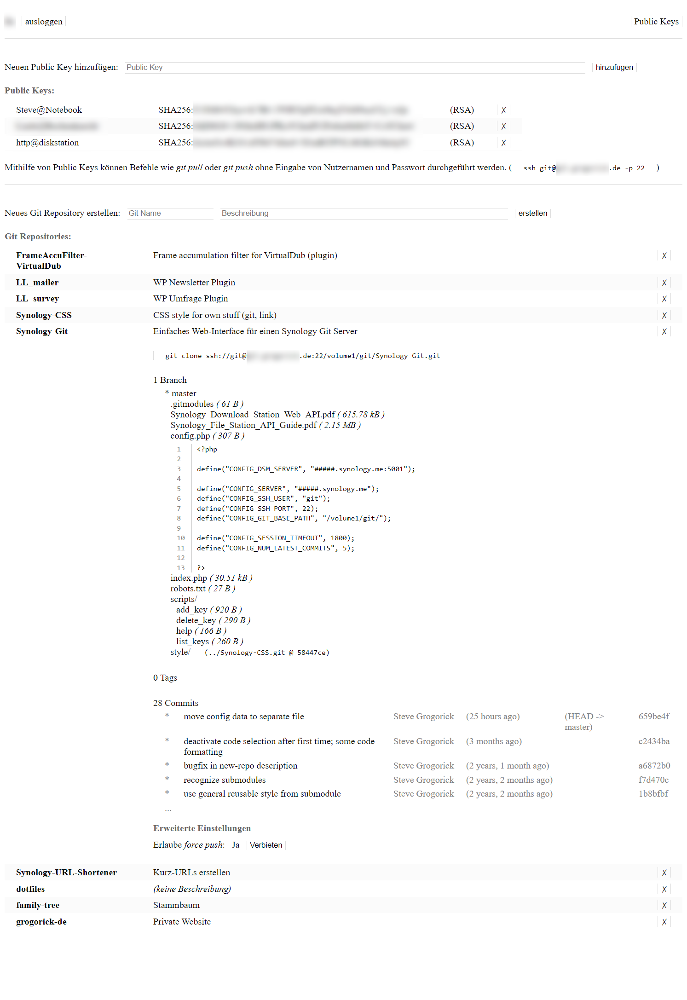

# Synology-Git
Git server web interface for small synology systems (that do not support things like Gitea via virtualization)

### Features:
- Login via diskstation accounts (FileStation API)
- Create/delete repos
- Browse repo branches, directories and files
- List commits and tags
- Preview files (text)
- En-/disable force push per repo
- Manage (add/remove) ssh keys

### Required Packages:
- Git Server *(Currently, there is an issue with the bundled git shell, and a work around using the community version. See https://community.synology.com/enu/forum/8/post/147518)*
- Web Server
- PHP 7.0+
- FileStation

*Setup instructions are included in the web interface.*

### Screenshot
